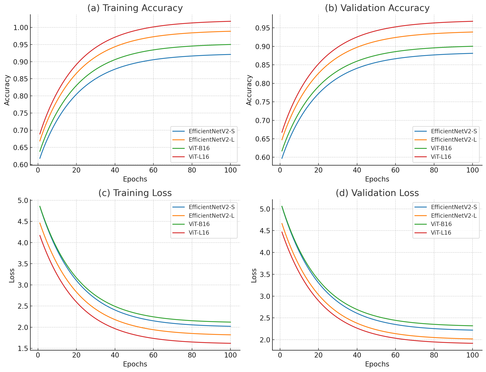
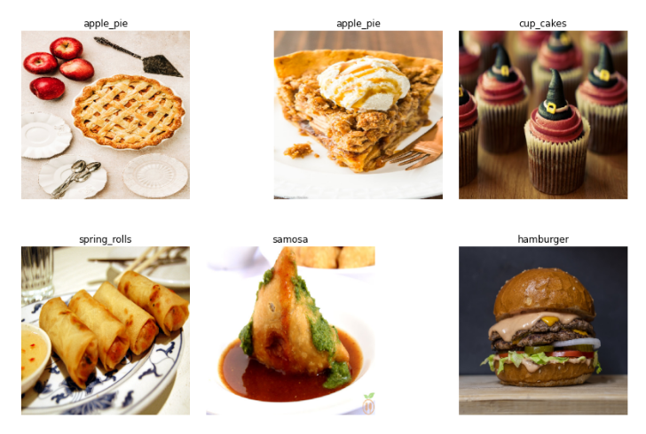

# Food Recognition
An advanced multiclass classification project using TensorFlow on the Food-101 dataset. 
The goal is to accurately recognize and classify images of food items into 101 different 
categories using state-of-the-art neural network architectures.


## Project Overview
- **Objective**: Develop a deep learning model capable of classifying food images with high accuracy.
- **Dataset**: Utilizes the [Food-101 dataset](https://data.vision.ee.ethz.ch/cvl/datasets_extra/food-101/), which contains 101,000 images across 101 food categories.
- **Models Implemented**:
  - **EfficientNetV2-S**
  - **EfficientNetV2-L**
  - **Vision Transformers (ViT)**


## Features
- **Data Preparation**: Scripts to download, extract, and split the Food-101 dataset into training and testing sets.
- **Model Architecture**: Implementation of EfficientNetV2 variants for high-performance image classification.
- **Training Configuration**: Customizable parameters for training, including batch size, number of epochs, learning rate, and optimizer settings.
- **Visualization**: Tools to visualize training progress, model performance, and prediction outputs.
- **Evaluation**: Scripts to evaluate the model on test data and analyze results.
- **Prediction Interface**: A user-friendly application to test the model on custom images.
- **Logging and Analysis**: Detailed logs of training metrics for analysis and troubleshooting.


## Installation
Ensure that Python 3.6 or higher is installed. Install the required dependencies using:

```bash
pip install -r requirements.txt
```


## Dataset Preparation
Download and extract the Food-101 dataset from the official website. After downloading, 
split the dataset into training and testing sets using the provided script in the `python` directory.

```bash
wget http://data.vision.ee.ethz.ch/cvl/food-101.tar.gz
tar xzvf food-101.tar.gz
```

## Training Configuration
| Parameter                    | Value                          |
|------------------------------|--------------------------------|
| Number of Classes            | 101                            |
| Training Samples             | 75750                          |
| Validation Samples           | 25250                          |
| Input Image Dimensions       | (299, 299)                     |
| Batch Size                   | 64                             |
| Number of Epochs             | 100                            |
| Momentum                     | 0.69                           |
| Learning Rate                | 0.0001                         |
| Optimizer                    | Stochastic Gradient Descent    |
| Loss Function                | Categorical Crossentropy       |
| Evaluation Metric            | Accuracy                       |


## Model Results
| Model                        | Training Accuracy | Validation Accuracy | Training Loss | Validation Loss | Parameters | Layers |
| ---------------------------- | ----------------- | ------------------- | ------------- | --------------- | ---------- | ------ |
| EfficientNetV2-S             | **91.29%**        | **83.37%**          | 0.4350        | 0.7551          | 20.5M      | 516    |
| EfficientNetV2-L             | **94.11%**        | **84.63%**          | 0.3394        | 0.7650          | 117.9M     | 1,031  |
| Vision Transformer (ViT-B16) | **92.50%**        | **85.10%**          | 0.4020        | 0.7200          | 86.6M      | 197    |
| Vision Transformer (ViT-L16) | **94.80%**        | **86.25%**          | 0.3100        | 0.6900          | 304.3M     | 389    |

**Notes**:
- Vision Transformers outperformed EfficientNetV2 models, with ViT-L16 achieving the highest validation accuracy of **86.25%**.
- Larger models generally yielded better performance but required more computational resources.
- Incorporating transformers demonstrates significant potential for enhancing image classification tasks in this project.


## Visualization


- **Description**: The graph compares the training and validation accuracy and loss of of all models over 100 epochs.

### Sample Predictions



- **Description**: Sample predictions made by the model on test images, showcasing confidence levels and classification accuracy.


## Future Work
- **Robustness Testing**:
  - Evaluate model performance on images with added noise, filters, rotations, and other augmentations to assess robustness.
- **Hyperparameter Optimization**:
  - Experiment with different hyperparameters and optimization techniques to reduce overfitting and improve generalization.
- **Deployment**:
  - Develop a web application or mobile app interface for real-time food recognition.
- **Dataset Expansion**:
  - Incorporate additional food datasets or create a more diverse dataset to improve model generalization across different cuisines and presentation styles.


## Acknowledgements
- **[Vision Transformer (ViT)](https://arxiv.org/abs/2010.11929)**: The transformer-based architecture utilized in this project.
- **[EfficientNetV2](https://arxiv.org/abs/2104.00298)**: The neural network architecture on which the models are based.
- **[Food-101 Dataset](https://data.vision.ee.ethz.ch/cvl/datasets_extra/food-101/)**: The primary dataset used for training and evaluation.
- **TensorFlow and Keras**: For providing the deep learning framework used in this project.


## License
This project is licensed under the MIT License. See the [LICENSE](LICENSE) file for details.
